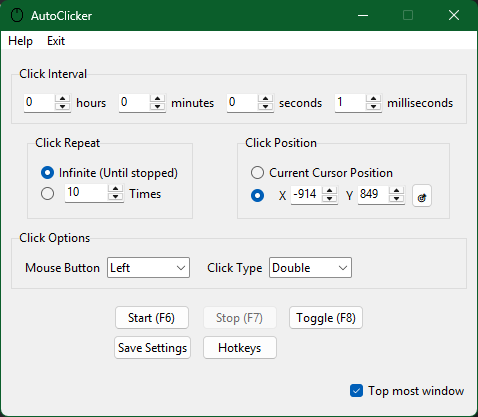

# 🖱️ Python AutoClicker GUI

Welcome to the Python AutoClicker, a simple yet powerful graphical user interface (GUI) application for automating mouse clicks. Built with `tkinter`, this tool allows you to configure click intervals, repetition, position, and type, making repetitive tasks a breeze! ✨

## 🚀 Features

* **Customizable Click Interval:** Set precise timings in hours, minutes, seconds, and milliseconds. ⏳
* **Flexible Click Repetition:** Choose between infinite clicks or a specific number of repetitions. 🔁
* **Targeted Click Position:**
    * Click at the current cursor position.
    * Specify exact X/Y coordinates. 🎯
    * Use the "Pick Location" feature to easily select a screen position with a click. 📍
* **Mouse Button & Type Selection:** Select Left, Right, or Middle mouse buttons and choose between Single or Double clicks. 🖱️
* **Global Hotkeys:** Control the autoclicker (Start, Stop, Toggle) even when the application is in the background using F6, F7, and F8. ⌨️
* **"Always on Top" Option:** Keep the autoclicker window visible over other applications. ⬆️
* **Persistent Settings:** Your configurations are automatically saved to `config.yaml` and loaded on startup. 💾
* **Clean GUI:** Intuitive and easy-to-use interface powered by `tkinter` and `ttk`. 🎨

## 📸 Screenshot

Here's a glimpse of the AutoClicker in action:



## 📦 Installation

To get this AutoClicker up and running on your system, follow these steps:

1.  **Clone the repository:**
    ```bash
    git clone https://github.com/fkhblul/Autoclicker.git
    cd python-autoclicker
    ```

2.  **Create a virtual environment (recommended):**
    ```bash
    python -m venv venv
    # On Windows
    .\venv\Scripts\activate
    # On macOS/Linux
    source venv/bin/activate
    ```

3.  **Install the required libraries:**
    ```bash
    pip install -r requirements.txt
    ```
## ▶️ Usage

1.  **Run the application:**
    ```bash
    python main.py
    ```

2.  **Configure your settings** in the GUI (interval, repeat mode, position, etc.).
    * To pick a specific spot, use the `🎯` button.

3.  **Start/Stop the autoclicker:**
    * Click the **Start (F6)**, **Stop (F7)**, or **Toggle (F8)** buttons.
    * Alternatively, use the global hotkeys `F6`, `F7`, or `F8` (even if the app is minimized).

4.  **Save your settings** by clicking `Save Settings`. They will be loaded automatically on the next launch.

## 🤝 Contributing

Feel free to fork the repository, open issues, or submit pull requests. Any contributions to improve this AutoClicker are welcome!

## 📜 License

This project is open-source and available under the [MIT License](LICENSE).

---